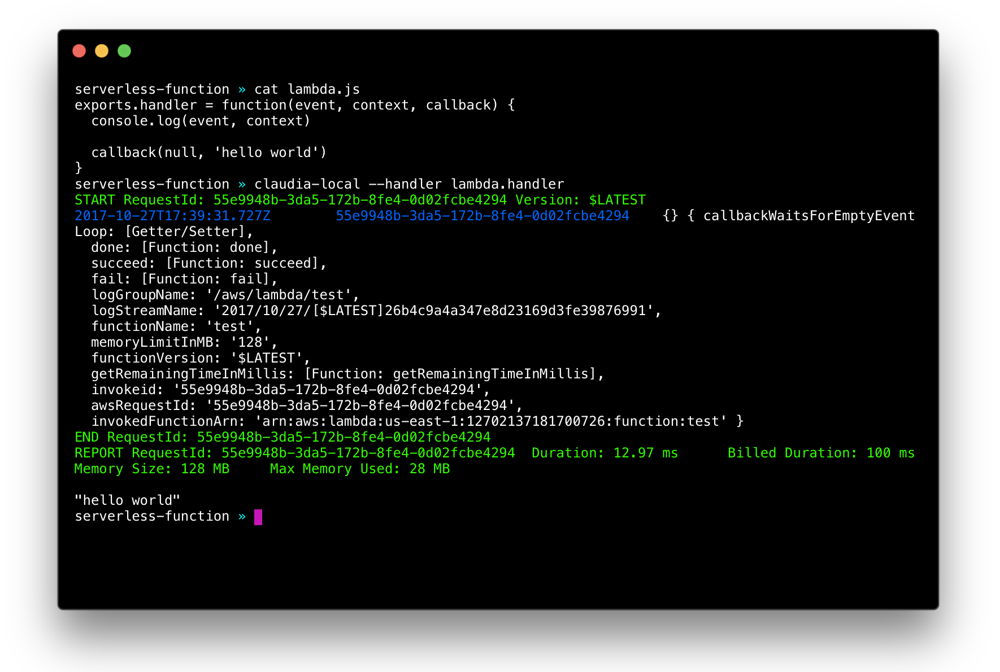

# claudia-local

[WIP] Run AWS Lambda functions created with Claudia.js locally.

This project is based on [docker-lambda](https://github.com/lambci/docker-lambda) created by [Michael Hart](https://github.com/mhart). Inspired by [SAM Local](https://github.com/awslabs/aws-sam-local).

## Example

If you have lambda.js file that looks like this:

```javascript
exports.handler = function (event, context) {
  context.succeed('hello world');
};
```

You can run following command from the same directory:

```shell
claudia-local --handler lambda.handler
```

And result should look like this:



## Features

At the moment, this is more like a TODO list, than list of features:

- [x] Run AWS Lamda function on docker-lambda locally
- [x] Simulate AWS Lambda memory
- [x] Simulate AWS Lambda timeout
- [x] Use selected IAM role
- [x] Read claudia.json if it exists
- [ ] Event generator — generate JSON triggers for S3, SNS, etc.
- [ ] Simple HTTP server that simulates API Gateway

## Installation

### Prerequisites

Running serverless projects and functions locally requires Docker to be installed and running.

To install docker visit:

- Mac: [Docker for Mac](https://store.docker.com/editions/community/docker-ce-desktop-mac)
- Windows: [Docker Toolbox](https://download.docker.com/win/stable/DockerToolbox.exe)
- Linux: Check your distro’s package manager (for example: `yum install docker`)

Verify that docker is working, and that you can run docker commands from the CLI (for example: `docker ps`). You do not need to install/fetch/pull any containers, that will be done automatically.

### Install from NPM

TBA

### Install from github

If you want to run dev version, you'll need to:

1. Clone this repository and enter the project folder
2. Install the dependencies (`npm i`)
3. Link the script (`npm link`)

After that, `claudia-local` command will point to the local version of the code.

## Command line arguments

List of currently available arguments:

- `handler` — specify handler function in format `file_name.exported_name`, for example if your `index.js` file uses `module.handler` for export, handler should be `index.handler`.
- `timeout` — specify AWS Lambda timeout in seconds, default is 3, and it can be between 3 and 300 seconds.
- `memory` — specify AWS Lambda memory in MBs, default is 128, and it can be between 128 and 1536 (1.5 GB) in 64MB increments.
- `runtime` — specify AWS Lambda runtime, default is `nodejs6.10`, and it can be `nodejs6.10` or `nodejs4.3`.
- `event` — [will change] specify JSON event that will be passed as AWS Lambda event. At the moment in `--event '{"hello": "world"}'` format.
